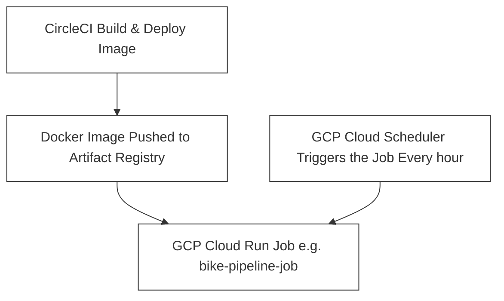

# Introduction

This is an example of mlops mvp project. The goal is personal learnings. Decide to start by exploring how to use 
* avro
* cloud scheduler for periodic training and inference

# Bike share

Bike sharing systems struggle with bikes being in the wrong place at the wrong time.
* Sometimes are empty
* Sometimes they are full and user cannot return the bikes

We want to predict bike net change per station to help rebalance bikes (ensure availability, reduce overflow).

NOTEs: for writting better later
* For simplicity we are overwritting previous models
* Assume training time are fast < 20minutes (cloud job has processing time limit. It is design for short jobs)

# Architecture

This pipeline runs every hour using Google Cloud Scheduler, which triggers a Cloud Run job. The job, packaged as a Docker image built and pushed via CircleCI, runs training (1_train.py) on the most recent data and immediately generates predictions (2_batch_predict.py) for the next hour. It is assumed that the total time is les. than 20 minutes. 



The trained model and predictions are stored in GCS under a path starting with prod/version/, mirroring the local project structure.

```sh
tree -L 2
.
├── 1_train.py
├── 2_batch_predict.py
├── Dockerfile
├── README.md
├── common
├── data
├── inference
│   ├── 202506230937_preds.avro
│   ├── 202506231626_preds.avro
│   ├── 202506231629_preds.avro
│   └── 202506231630_preds.avro
├── logs
├── models
│   ├── fake_model.pkl
│   └── fake_model_metadata.json
├── requirements.txt
├── run.py
├── security
└── setup_infra.sh
```

# Setting infra

1. create iam: 
1. create gcs 
1. create the cloud job
1. create clooud scheduler

```sh
       # NOTE: Create a service account and download its key

       # NOTE: create iam and mage iam for servoce accounts
       gcloud iam service-accounts create bike-share-job \
              --project=mlops-project-abacabb \
              --description="Service account for bike share project" \
              --display-name="bike-share-service-account"

       # list all accounts
       gcloud projects get-iam-policy mlops-project-abacabb

       # lits only services accounts
       gcloud iam service-accounts list --project=mlops-project-abacabb

       # delete
       gcloud iam service-accounts delete \
              pipeline-job-sa@mlops-project-abacabb.iam.gserviceaccount.com \
              --project=mlops-project-abacabb

       # NOTE: Grant access
       gcloud projects add-iam-policy-binding mlops-project-abacabb \
              --member="serviceAccount:bike-share-job@mlops-project-abacabb.iam.gserviceaccount.com" \
              --role="roles/storage.admin"

       # NOTE: Generate and download the key file
       gcloud iam service-accounts keys create ~/gcp-bike-share-key.json \
              --iam-account=bike-share-job@mlops-project-abacabb.iam.gserviceaccount.com \
              --project=mlops-project-abacabb
```

The remainning steps can be seen in the script `setup_infra.sh`

# How to set google credentials on circleci

   1. Projedct Settings
   1. Enviroment variable
      * Add a new env variable

   1. Copy the base64 contents of the security/gcp-bike-share-key.json

   ```sh
   base64 -i security/gcp-bike-share-key.json | pbcopy
   ```

# Next: how to scale 

   How I would change the architecture if the number of bike stations are big and the statiosn are spread on multiply cities in one country.
   1. move to better scheduler: Airflow with astronomer
   2. change architecture to scale