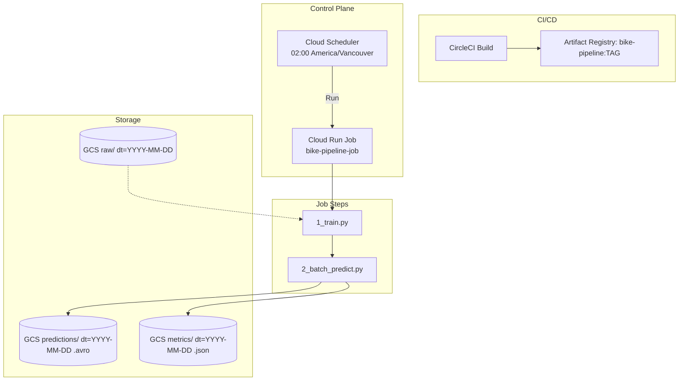

# Introduction

This is an example of mlops mvp project. The goal is personal learnings. Decide to start by exploring how to use 
* avro
* cloud scheduler for periodic training and inference

# Bike share goal

Bike sharing systems struggle with bikes being in the wrong place at the wrong time.
* Sometimes are empty
* Sometimes they are full and user cannot return the bikes

We want to predict bike net change per station to help rebalance bikes (ensure availability, reduce overflow).

# Architecture

This pipeline runs every night using Google Cloud Scheduler, which triggers a Cloud Run job. The job, packaged as a Docker image built and pushed via CircleCI, runs training (1_train.py) on the most recent data and immediately generates predictions (2_batch_predict.py) for the next days. It is assumed that the total time is less than 30 minutes. The MVP is trained only in 1 city with multiple stations. 





The trained model and predictions are stored in GCS under a path starting with prod/version/, mirroring the local project structure.

```sh
tree -L 2
.
├── 1_train.py
├── 2_batch_predict.py
├── Dockerfile
├── README.md
├── common
├── data
├── inference
│   ├── 202506230937_preds.avro
│   ├── 202506231626_preds.avro
│   ├── 202506231629_preds.avro
│   └── 202506231630_preds.avro
├── logs
├── models
│   ├── fake_model.pkl
│   └── fake_model_metadata.json
├── requirements.txt
├── run.py
├── security
└── setup_infra.sh
```

NOTEs: 
* For simplicity we are overwritting previous models after retraining
* Assuming training time are fast 

# Setting infra

1. create iam 
1. create gcs 
1. create the cloud job
1. create clooud scheduler

```sh
  export PROJECT_ID="mlops-project-id"
  export SA="service-account"  # service account name (no domain)

  # NOTE: Create a service account and download its key
  # NOTE: create iam for service accounts
  gcloud iam service-accounts create "$SA" \
        --project="$PROJECT_ID" \
        --description="Service account for bike share project" \
        --display-name="service-account-name"

  # list only service accounts
  gcloud iam service-accounts list --project="$PROJECT_ID"

  # NOTE: Grant access to GCS
  gcloud projects add-iam-policy-binding "$PROJECT_ID" \
        --member="serviceAccount:${SA}@${PROJECT_ID}.iam.gserviceaccount.com" \
        --role="roles/storage.admin"

  # NOTE: Generate and download the key file
  gcloud iam service-accounts keys create ~/key.json \
        --iam-account="${SA}@${PROJECT_ID}.iam.gserviceaccount.com" \
        --project="$PROJECT_ID"

```

The remainning steps can be seen in the script `setup_infra.sh`

# How to set google credentials on circleci

   1. Projedct Settings
   1. Enviroment variable
      * Add a new env variable

   1. Copy the base64 contents of the security/key.json

   ```sh
   base64 -i security/key.json | pbcopy
   ```

# Scale horizontaly

  n this section we describe the evolution of the MVP project. The requirements changed. The project runs predictions for a couple more cities with multiple stations and trains more often. Models are trained 3 times a day: 4:00am, 10:00am, and 4:00pm. The model takes about 2 hours to train. Every time the batch prediction script runs it will generate predictions for the next 6 hours for all cities and stations: 6:00am–12:00pm, 12:00pm–6:00pm, and 6:00pm–12:00am. It is assumed that the service is closed after midnight.


  Under this new set of requirements the project will change:

   1. replace the simple scheduler by a scheduler/orchestrator (Airflow/Google Cloud Composer)
   2. Airflow DAGs will start training and batch predictions on ML platforms (Google Vertex AI)
   3. Docker images will be stored on a Docker registry service (Google Artifact Registry)
  

  ```mermaid
  flowchart TD
    subgraph CI[CI/CD]
      A[CircleCI Build] --> B[Artifact Registry: bike-pipeline:TAG]
    end

    subgraph SCHED[Control Plane]
      D1[Airflow/Cloud Composer<br/>Train DAG<br/>04:00, 10:00, 16:00 PT] -->|Trigger| T
      D2[Airflow/Cloud Composer<br/>Batch Predict DAG<br/>06:00, 12:00, 18:00 PT] -->|Trigger| P
    end

    subgraph PIPE[Job Steps]
      T[Vertex AI Custom Job<br/>runs 1_train.py 2h]
      P[Vertex AI Batch Prediction<br/>runs 2_batch_predict.py 6h windows]
    end

    subgraph DATA[Storage]
      R[(GCS raw/ dt=YYYY-MM-DD)] -.-> T
      P --> W[(GCS predictions/ dt=YYYY-MM-DD .avro)]
      P --> M[(GCS metrics/ dt=YYYY-MM-DD .json)]
    end
  ```

  # Scale verticaly

     TODO