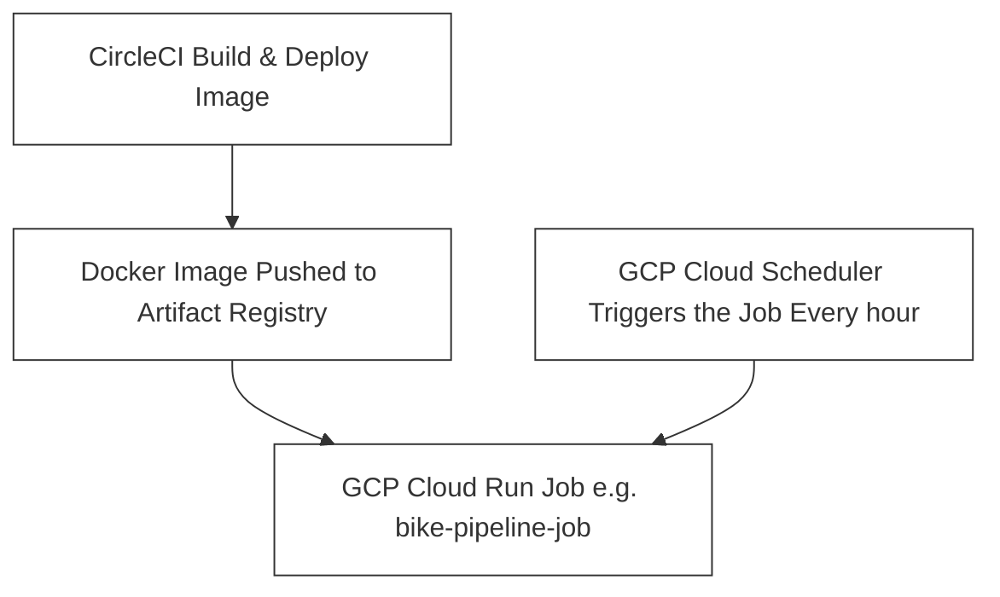

# Introduction

This is an example of mlops mvp project. The goal is personal learnings. Decide to start by exploring how to use 
* avro
* cloud scheduler for periodic training and inference

# Bike share

Bike sharing systems struggle with bikes being in the wrong place at the wrong time.
* Sometimes are empty
* Sometimes they are full and user cannot return the bikes

We want to predict bike net change per station to help rebalance bikes (ensure availability, reduce overflow).

NOTEs: for writting better later
* For simplicity we are overwritting previous models
* Assume training time are fast < 20minutes (cloud job has processing time limit. It is design for short jobs)

# Architecture



# Setting infra

1. create iam
1. create gcs 
1. create the cloud job
1. create clooud scheduler

# How to set google credentials on circleci

   1. Projedct Settings
   1. Enviroment variable
      * Add a new env variable

   1. Copy the base64 contents of the security/gcp-bike-share-key.json

   ```sh
   base64 -i security/gcp-bike-share-key.json | pbcopy
   ```

# Next: how to scale 

   How I would change the architecture if the number of bike stations are big and the statiosn are spread on multiply cities in one country.
   1. move to better scheduler: Airflow with astronomer
   2. change architecture to scale